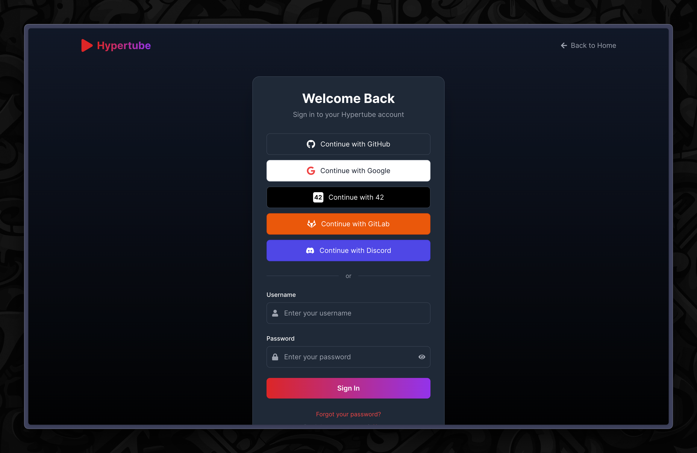
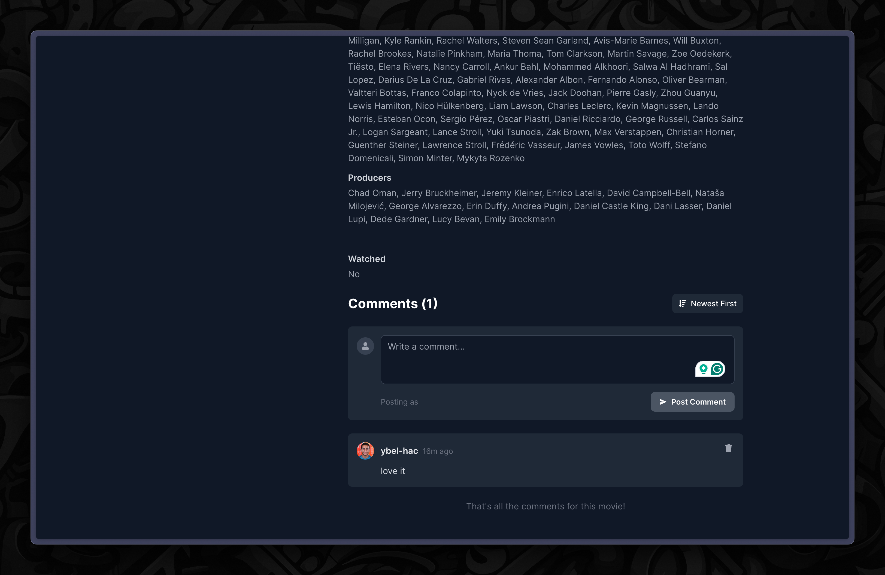

# Hypertube

[](https://hitcount.dev/p/UBA-code/https://github.com/UBA-code/hypertube)

🍿 **Hypertube** is a modern, Netflix-inspired movie streaming application that leverages BitTorrent technology to deliver thousands of movies instantly, right in your browser. Enjoy HD streaming with no ads, no subscriptions, and no waiting.

## Features

- **Advanced Search**: Find movies across multiple torrent sources, filter by quality, genre, and rating.
- **Instant Streaming**: Start watching instantly with smart streaming—no waiting for downloads.
- **Background Download**: Movies continue to download as you watch.
- **Multi-language Subtitles**: Access subtitles in dozens of languages with auto-sync.
- **Community Interaction**: Discuss movies, share recommendations, and connect with other film lovers.
- **Secure Authentication**: Sign in with OAuth providers (GitHub, Google, Gitlab, Discord, 42) or email, with industry-standard security.
- **Modern UI**: Responsive, dark-mode interface inspired by popular streaming platforms.

## Tech Stack

- **Frontend**: React, TypeScript, Tailwind CSS, Vite, React Router, React Icons
- **Backend**: NestJS (TypeScript), Swagger for API documentation
- **Streaming**: Uses HLS (HTTP Live Streaming) with FFmpeg for real-time video streaming.
- **Authentication**: OAuth and email-based authentication
- **Deployment**: Docker support for both frontend and backend

## Getting Started

### Prerequisites

- Node.js and npm (recommended: latest LTS)
- Docker (optional, for containerized deployment)

### Development Setup

**make sure to fill the `.env.preview` file with the necessary credentials and rename it to `.env.dev`.**

Docker (Frontend):

```bash
docker-compose up --build
```

### Access

- Frontend: `http://localhost:5173`
- Backend API: `http://localhost:3000/api`

## Screenshots

Here are some screenshots of Hypertube in action:

### Authentication Page



### Landing Page


### Popular Movies


### Movie Details


### Streaming Player


### Community and Comments



### Watch history


## Example Usage

- **Browse**: Search for your favorite movies by name, genre, or rating.
- **Stream**: Click to instantly start streaming in HD.
- **Interact**: Join discussions, leave comments, and rate movies.
- **Subtitle**: Select subtitle language from the player.
- **Register/Login**: Use OAuth or email to create a secure account.

## License & DMCA

This is a demonstration project. Content streamed via Hypertube is provided through peer-to-peer technology. Please respect copyright laws applicable in your country.

---

© 2025 Hypertube. All rights reserved.
